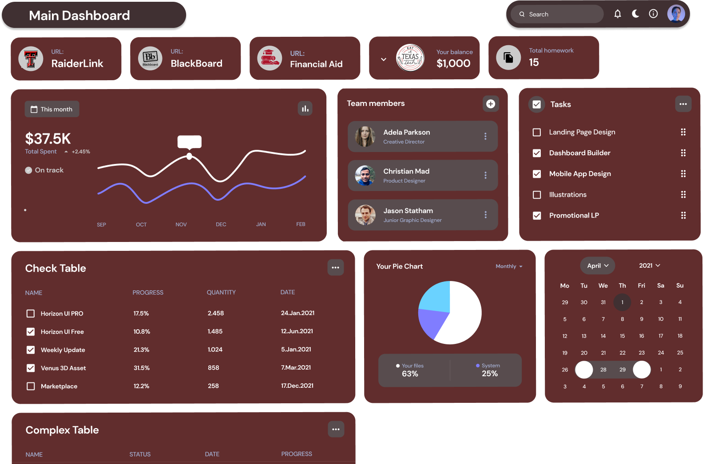

# Texas Tech University App 🚀

Welcome to the **Texas Tech University App** project! 🎓📱 As a proud Red Raider and passionate programmer, I noticed that our current university app wasn't meeting the needs of students and the community. So, I decided to take action and create something that represents **Texas Tech**.

## 🛠 Technologies Used

This project has evolved with me. What started in **.NET** was later reimagined in **Electron**, and now it's actively being developed in **Swift**. My goal is to take the university app to the next level with a modern, fast, and highly functional app.

- **.NET**: Where it all began, laying the foundation of the project.
- **Electron**: Exploring cross-platform possibilities.
- **Swift**: The future. I'm taking the project to a new level of quality and performance for iOS.

## 🎯 Goals

My aim is to make the app faster, more intuitive, and accessible to all Texas Tech students. I'm determined to implement new features that the official website lacks, such as:

- **Custom event calendar**.
- **Interactive campus map** with real-time directions.
- **Direct access to grades and assignments** from Blackboard.
- **Smart notification system** to never miss a deadline.

## ✅ Task Checklist

- [x] Implement basic user interface in Swift.
- [x] UX/UI
- [x] Add student login authentication system.
- [ ] Integrate event calendar.
- [ ] Add real-time notifications.
- [ ] Improve loading speed with Swift optimizations.
- [ ] Support for dark mode.

## 🤝 How to Contribute

If you like **Texas Tech** as much as I do and have programming skills, I’d love your help! Here’s how you can contribute:

1. **Fork this repository**.
2. **Create a new branch** (`git checkout -b feature/new-feature`).
3. **Commit your changes** (`git commit -m 'Added a new feature'`).
4. **Push to the branch** (`git push origin feature/new-feature`).
5. **Open a Pull Request**.

### Pull Request Guidelines

- Make sure your code is clean and well-commented.
- Follow Swift’s style guidelines.
- Include screenshots or descriptions of the new features.

## 🏛️ My Motivation

I am student ion  **Texas Tech University** and I love coding. This project is my way of giving back to the community by building a tool that truly makes a difference. I’m committed to ensuring that the app reflects the excellence

Thanks for stopping by and contributing! 🤘

---